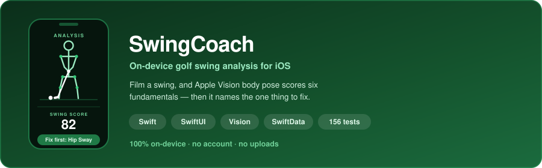

# Hey, I'm George! 👋

<table>
<tr>
<td valign="top" width="58%">

### Software Engineer I @ PayPal &nbsp;·&nbsp; Chicago, IL

- 🎓 &nbsp;MSc Computer Science, Machine Learning — **Georgia Tech** *(in progress)*
- 🎓 &nbsp;BS Computer Science — **University of Illinois**
- 👨‍💻 &nbsp;Currently building **[SwingCoach](https://github.com/GeorgeFashho/SwingCoach)** — on-device golf swing analysis for iOS
- ⚡ &nbsp;Day to day: Java, Python, SQL, Kafka, Snowflake

</td>
<td valign="top" width="42%">

</td>
</tr>
</table>

---

## Featured Project

I'm learning to golf and ended up with a camera roll full of swing videos I couldn't actually read. So I built **[SwingCoach](https://github.com/GeorgeFashho/SwingCoach)**: film a swing, and Apple Vision body pose scores six fundamentals against known-good ranges, then names the single thing to fix. Everything runs on the phone.

## Languages & Tools

**Languages**

**Frameworks & Libraries**

**Infrastructure & Data**

**Tooling**

---

## Let's Connect

  

